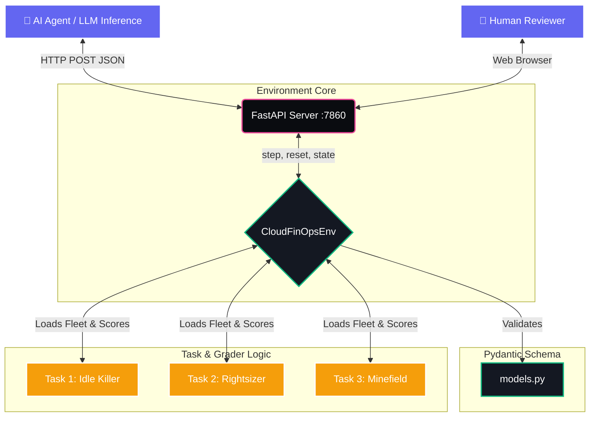

<div align="center">
  <h1>💸 OpenEnv: Cloud FinOps Agent</h1>
  <p><em>A high-stakes, real-world Cloud Cost Optimization Environment built for the <strong>OpenEnv Hackathon 2026</strong>.</em></p>
  
  [](https://github.com/openenv)
  [](https://fastapi.tiangolo.com/)
  [](https://huggingface.co/spaces)
</div>

---

## 🚀 Overview

**Cloud resource management is a complex, dollar-sensitive optimization problem.** 
In this environment, an AI Agent acts as an Enterprise FinOps Analyst. Its goal is to navigate a sprawling, dynamic cloud fleet to maximize cost efficiency without breaching rigid Service Level Agreements (SLAs). 

Instead of toy domains or games, the **Cloud FinOps Agent** simulates high-consequence enterprise IT. The agent must successfully track misprovisioned instances, aggressively terminate idle resources, and most importantly—**never touch Production.**

---

## 🏗️ System Architecture

Our environment natively wraps the OpenEnv specification in a robust FastAPI server. This allows AI endpoints or scripts to interact flawlessly via JSON payloads, while simultaneously hosting an interactive frontend UI for human testing.



---

## 📁 Project Structure

The project is structured beautifully flat, containing 0 bloat, making it incredibly easy to validate and audit for the hackathon judges.

```text
📦 cloud-finops-agent
 ┣ 📜 openenv.yaml        # OpenEnv specifications & task metadata definitions
 ┣ 📜 models.py           # Strictly-typed Pydantic schemas (Action, Reward, State)
 ┣ 📜 env.py              # The core step() / reset() / state() simulation logic
 ┣ 📜 tasks.py            # Fleet initializers & deterministic difficulty graders
 ┣ 📜 app.py              # FastAPI server exposing OpenEnv endpoints + UI serving
 ┣ 📜 index.html          # Stunning Glassmorphism Dark-Mode Manual Testing UI
 ┣ 📜 baseline.py         # Out-of-the-box Inference script using OpenAI/HF APIs
 ┣ 📜 Dockerfile          # Containerization for Hugging Face Spaces
 ┗ 📜 requirements.txt    # Python dependencies
```

---

## ⚔️ The Task Tiers

The fleet challenges are scoped across three escalating environments, each yielding normalized `[0.0, 1.0]` grader scores.

| Difficulty | Task Name | Description | Mechanics |
| :---: | :--- | :--- | :--- |
| **🟢 Easy** | `idle_killer` | 5 Servers. Target 2 isolated developer machines burning $70/day with 0% CPU footprint. | Agent uses `terminate_instance()` safely to isolate bloat. |
| **🟡 Medium** | `rightsizer` | 10 Servers. Active fleet where 3 nodes are vastly oversized. Terminations are disabled. | Agent uses `resize_instance()` avoiding disruption to running workflows. |
| **🔴 Hard** | `minefield` | 20 Mixed Servers. Targets are hidden directly alongside mission-critical systems. | **Lethal Guardrails:** Modifying *any* production server yields a maximum penalty and terminates the simulation. |

---

## ✨ Hackathon Highlights (Why this fits the criteria)

1. **Real-World Application:** Completely abandons gaming. It tests LLM tool-calling reliability in a corporate "read/write" infrastructure mapping context.
2. **Incremental Reward Function:** We explicitly avoided sparse rewards. Every legitimate action grants scaled rewards proportional to exact dollars-saved (`$20 saved = +0.20`), minus micro-penalties (`-0.01` per step) to actively suppress brute-force guessing behaviors.
3. **Native Safety Constraints:** Demonstrates agent alignment capabilities. The AI must aggressively optimize while recognizing "Production" environment flags to avoid catastrophic failure.

---

## 🛠️ Quick Start & Local Testing

### 1. Web UI (Manual Testing)
If deployed to Hugging Face Spaces, simply navigate to the Root URL (e.g. `https://kanth891-cloud-finops-agent.hf.space/`). 
You will be greeted by a custom-built, interactive dashboard where you can manually click through instances to stress-test the `step()` functionality.

### 2. Testing API Endpoints (Agent Perspective)
Agents interact with the environment via perfectly structured JSON outputs. Send raw calls using your terminal:

**Reset the Environment:**
```bash
curl -X POST "http://localhost:7860/openenv/reset" -H "Content-Type: application/json" -d "{}"
```

**Dispatch a Tool Call (Scale down server):**
```bash
curl -X POST "http://localhost:7860/openenv/step" \
     -H "Content-Type: application/json" \
     -d '{"action": "resize_instance(server_id='\''srv_01'\'', new_size='\''small'\'')"}'
```

### 3. Running the Baseline LLM Test
Configure your model of choice (Testing verified on Qwen 2.5 72B & GPT-4o) and run the full local agent sweep:

```bash
export HF_TOKEN="your-huggingface-token"
python baseline.py
```
